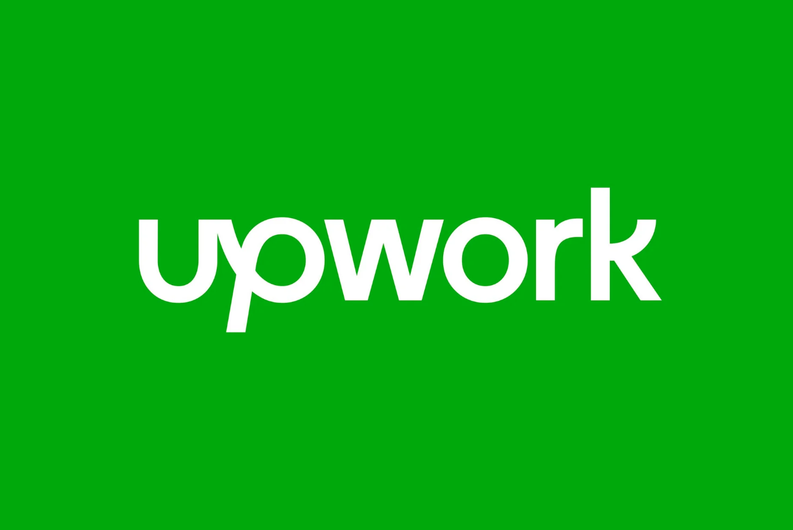

<!-- BANNER -->

  

<!-- ANIMATED INTRO -->

  

<h2 align="center">👋 Welcome to my Digital Playground</h2>

  <a href="https://www.linkedin.com/in/omar-ashraf-dev">LinkedIn</a> •
  <a href="mailto:omar.ashraf.dev@gmail.com">Email</a> •
  <a href="https://wa.me/201154688628">WhatsApp</a>

  

<!-- STATS -->

  
  

---

<!-- PORTFOLIO -->
<h2 align="center">🌟 My Portfolio</h2>

<table>
  <tr>
    <td align="center">
      <a href="https://omar-flax.vercel.app/">
        
         <b>My Portfolio</b>
      </a>
       Explore my latest projects, case studies, and development work in one place.
    </td>
    <td align="center">
      <a href="https://www.upwork.com/freelancers/~016247fec408960a4d">
        
         <b>My Upwork Profile</b>
      </a>
       Check out my Upwork profile for freelance opportunities, client reviews, and work history.
    </td>
  </tr>
</table>

---

<!-- TECH STACK SECTION WITH VISUALS -->
<h2 align="center">🛠️ My Tech Universe</h2>

<table>
  <tr>
    <td align="center" width="96">
      
       Flutter
    </td>
    <td align="center" width="96">
      
       Dart
    </td>
    <td align="center" width="96">
      
       JavaScript
    </td>
    <td align="center" width="96">
      
       TypeScript
    </td>
    <td align="center" width="96">
      
       React
    </td>
    <td align="center" width="96">
      
       Node.js
    </td>
  </tr>
  <tr>
    <td align="center" width="96">
      
       Java
    </td>
    <td align="center" width="96">
      
       Spring
    </td>
    <td align="center" width="96">
      
       HTML5
    </td>
    <td align="center" width="96">
      
       CSS3
    </td>
    <td align="center" width="96">
      
       Tailwind
    </td>
    <td align="center" width="96">
      
       Firebase
    </td>
  </tr>
  <tr>
    <td align="center" width="96">
      
       MongoDB
    </td>
    <td align="center" width="96">
      
       Python
    </td>
    <td align="center" width="96">
      
       TensorFlow
    </td>
    <td align="center" width="96">
      
       Git
    </td>
    <td align="center" width="96">
      
       Docker
    </td>
    <td align="center" width="96">
      
       Supabase
    </td>
  </tr>
</table>

---

<!-- FEATURED PROJECTS WITH CARDS -->
<h2 align="center">🚀 Featured Projects</h2>

<table>
  <tr>
    <td width="50%">
      <b>Elostaz</b> 
      
       Educational platform connecting students with tutors, featuring course management and interactive learning tools. 
      
      
    </td>
    <td width="50%">
      <b>Omar</b> 
      
       Personal portfolio website showcasing projects, skills, and experience in an interactive and modern UI. 
      
      
    </td>
  </tr>
  <tr>
    <td width="50%">
      <b>AI Interviewer</b> 
      
       AI-powered interview preparation tool that provides realistic mock interviews with instant feedback. 
      
      
    </td>
    <td width="50%">
      <b>AI Optimization</b> 
      
       Advanced optimization algorithms and machine learning models for solving complex optimization problems. 
      
      
    </td>
  </tr>
</table>

---

<!-- ABOUT ME SECTION -->
<h2 align="center">🧠 About Me</h2>

### Who I Am
I'm a passionate full-stack developer with a special focus on Flutter mobile development and AI integration. With a background in computer science and over 3 years of professional experience, I've mastered the art of building elegant, scalable, and performant applications that solve real-world problems. My journey in tech has been driven by curiosity and a desire to create meaningful digital experiences that make a difference.

### What Drives Me
- 🔍 **Problem Solver**: I thrive on challenges and love turning complex problems into simple, elegant solutions
- 🌱 **Continuous Learner**: Technology evolves rapidly, and I make it a priority to stay ahead of the curve
- 🤝 **Collaborative Spirit**: I believe the best products emerge from diverse teams working together
- 🌟 **Impact-Focused**: I measure success by the positive change my applications bring to users' lives
- 💡 **Innovation Seeker**: Always exploring new technologies and methodologies to push boundaries

### Beyond the Code
- 📚 I'm an avid reader of tech literature and philosophy
- 🎮 Gaming enthusiast and occasional game developer
- 🏃‍♂️ Fitness enthusiast who believes in keeping the mind and body in balance
- ✈️ Travel enthusiast who draws inspiration from different cultures and perspectives

### My Development Philosophy
> "Any fool can write code that a computer can understand. Good programmers write code that humans can understand."
> — Martin Fowler

I'm committed to writing clean, maintainable, and well-documented code that not only works today but remains adaptable for tomorrow's needs. I believe that the best software is born at the intersection of technical excellence, user empathy, and business understanding.

---

<!-- SKILLS SECTION WITH VISUAL REPRESENTATION -->
<h2 align="center">📊 Skills & Expertise</h2>

<table>
  <tr>
    <td width="50%">
      <b>Programming & Frameworks</b> 
      <ul>
        <li><b>Flutter/Dart</b> — 95%</li>
        <li><b>JavaScript/TypeScript</b> — 90%</li>
        <li><b>React/Next.js</b> — 85%</li>
        <li><b>Java/Spring Boot</b> — 80%</li>
        <li><b>Python</b> — 75%</li>
      </ul>
    </td>
    <td width="50%">
      <b>Tools & Technologies</b> 
      <ul>
        <li><b>Firebase/Supabase</b> — 95%</li>
        <li><b>Git/GitHub</b> — 90%</li>
        <li><b>AI Integration</b> — 85%</li>
        <li><b>UI/UX Design</b> — 80%</li>
        <li><b>Cloud Services</b> — 70%</li>
      </ul>
    </td>
  </tr>
</table>

---

<!-- GITHUB STATS SECTION -->
<h2 align="center">📈 GitHub Analytics</h2>

  
  

  

  

---

<!-- RECENT ACTIVITY SECTION -->
<h2 align="center">⚡ Recent Activity</h2>

  

---

<!-- CONTACT SECTION -->
<h2 align="center">📬 Let's Connect</h2>

  
  
  
  
  

---

  
   
  
   
  ⭐️ From <a href="https://github.com/www-e">Omar Ashraf</a> • 💻 Code Craftsman • 🌐 Digital Explorer

